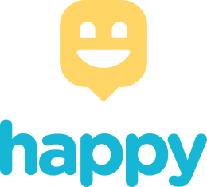
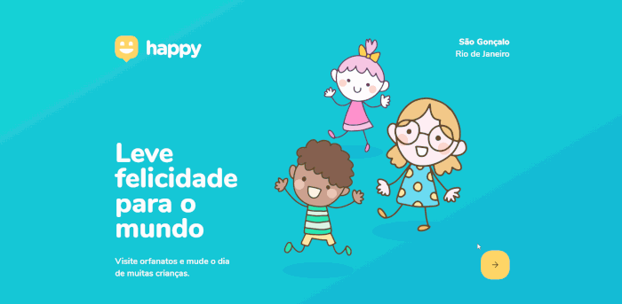
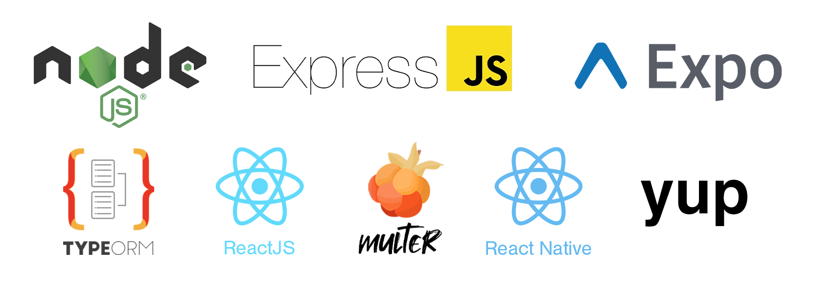

 

O Happy é uma plataforma cujo objetivo é trazer mais alegria às vidas de milhares de crianças por meio da localização dos orfanatos mais próximos do usuário. É, em homenagem ao Dia das Crianças o tema da terceira edição da Next Level Week, evento gratuito realizado pela Rocketseat.  

## Conceitos Abordados

## ><b>• SPA - Single Page Application</b> 
## • Tipagem - Utilização Extensa do TypeScript para estruturação e manipulação dinâmicas do DOM 
## <b>• Responsividade - Mobile First</b> 
## • Banco de Dados com SQLite e TypeScript - TypeORM 
## <b>• Criação e utilização de APIs</b>

## Tecnologias Utilizadas

<b> LICENSE: Este projeto encontra-se sob a licença MIT. Veja [LICENSE](LICENSE) para mais informações.
